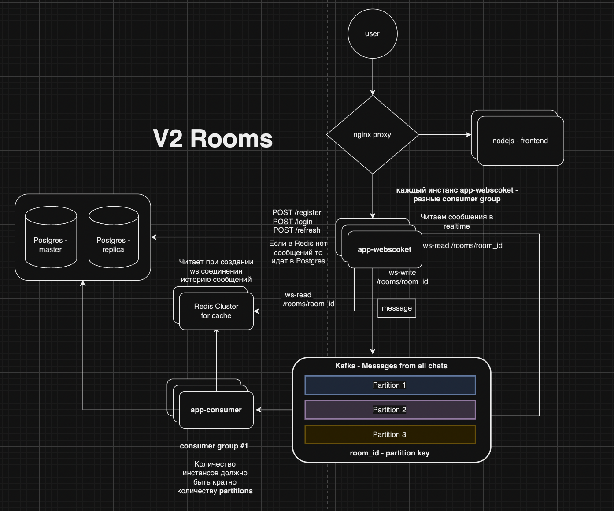

### Rooms V2

Video walkthrough on YouTube:

<a href="https://www.youtube.com/watch?v=qNGk5E-8bGw" title="rooms"></a>

This repository holds the V2 version of the **Rooms** messenger.

The service is live at [rooms.servebeer.com](https://rooms.servebeer.com).

What V2 added over the previous version:

- New backend components: Kafka, Redis, and the `app-consumer` and `app-websocket` microservices,
  each of which can run in several instances.
- Postgres, Redis and Kafka images are taken from [bitnami/containers](https://github.com/bitnami/containers).
  All three run as fault-tolerant clusters with replication.
- All configuration lives in one place, the `config` directory.
- A `nodejs` frontend, with `nginx` in front routing requests to the frontend and backend components.
- Hosted on [cloud.ru](https://cloud.ru), with HTTPS certificates issued through `letsencrypt`.

### V2 architecture



*Note: the Postgres replica is not yet implemented, in production or in the code. It is deferred to the next release.*

### Planned for V3 — application logic

- Split the WebSocket connection handling and the authentication/authorization servers into separate microservices.
- Keep authentication and authorization on `Postgres`, and move message storage to `Cassandra`.
- Pay down the Postgres replica debt.

### Planned for V4 — infrastructure

- Move the service from `docker-compose` to Kubernetes, using helm charts from the same [bitnami/charts](https://github.com/bitnami/charts).
- Full observability on top of the cluster: logs through `fluentd`, metrics through `prometheus`,
  dashboards in `grafana`, traces in `jaeger` — ideally via operators watching those resources,
  with an export path into a database.
- Replace the Nginx load balancer with an Ingress operator.
- Configure `AFFINITY` so that pods of the same microservice are not scheduled onto one node.
- CI/CD: [fluxcd](https://fluxcd.io/) for CD, GitHub Actions for CI.

### Planned for V5 — cloud

- Describe managed Kubernetes infrastructure in Terraform, converting the `yaml` with [k2tf](https://github.com/sl1pm4t/k2tf).
- Separate prod and dev environments in the cloud.

### Running locally

- `cd frontend && npm install`
- `cd .. && make docker-local`
- Wait for everything to come up; follow the logs
- Then apply the migrations:

```
db=pg make migrate-up          # create Postgres tables and indexes
make create-kafka-topic-local  # create the Kafka topic
```

- Endpoints are served on localhost:80:

```
POST /api/user/register          # sign up
POST /api/user/login             # sign in
POST /api/user/refresh           # JWT refresh, used by the frontend
POST /api/chat/rooms             # create a room
GET  /api/chat/rooms             # list rooms
GET  /api/chat/rooms/{id}/clients # list clients connected to a room
WS   /api/chat/rooms/{id}        # connect to a room
```

- `Postman` is the most convenient client for trying it out; the collection is in `tests/postman`.

### Deploying to the cloud

- Get the private key from the VM owner.
- Copy the repository onto the VM — check with the owner first, in case files there have not yet
  been moved into the main repository:
  `scp -r rooms user1@rooms.servebeer.com:rooms`
- `ssh user1@rooms.servebeer.com`
- `cd rooms/frontend && rm -rf node_modules .next package-lock.json`
- `npm cache clean --force`
- `npm install`
- `cd .. && make docker-dev`
- Wait for everything to come up; follow the logs
- Then apply the migrations:

```
db=pg make migrate-up        # create Postgres tables and indexes
make create-kafka-topic-dev  # create the Kafka topic
```

- [rooms.servebeer.com](https://rooms.servebeer.com)

### Sources of inspiration

- [A 10-minute video on YouTube](https://www.youtube.com/watch?v=xyLO8ZAk2KE)
- Chapter 12 of *System Design Interview* by Alex Xu
- [A longer video](https://www.youtube.com/watch?v=vvhC64hQZMk)
