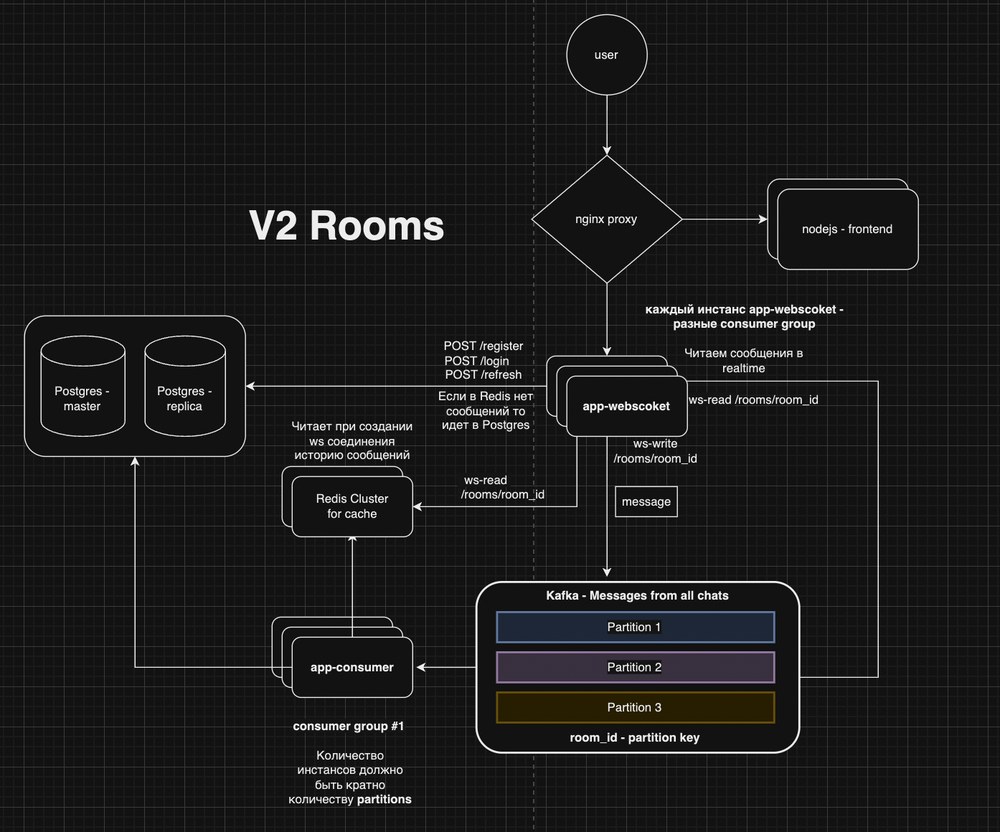

### V2 Rooms

В данном репозитории реализована V2-версия мессенджера **Rooms**. 

Вы можете пользоваться сервисом **Rooms** уже сейчас: [rooms.servebeer.com](https://rooms.servebeer.com)

Что было добавлено по сравнению прошлой версией:
- Добавлены новые компоненты бэкенда: Kafka, Redis и микросервисы `app-consumer`, `app-websocket` которые можно создавать в нескольких инстансах.
- Образы для Postgres, Redis и Kafka взяты с [bitnami/containers](https://github.com/bitnami/containers). Одно из лучших решений на рынке.
Каждый из 3х компонент является отказоустойчивым кластером c репликацией.
- Все конфиги хранятся в едином месте - папке `config`
- Появился frontend `nodejs` и `nginx` прокси для маршрутизации запросов в компоненты frontend и backend
- Захостили на [cloud.ru](https://cloud.ru) наш сервис и используя `letsencrypt` сгенерировали сертификаты для HTTPS протокола

### Архитектура V2



* Замечание: *Postgres Replica* на данный момент не реализована в продакшене и в коде в целом. Это дело перенесено на следующий релиз.

### Дальнейшие планы для V3 - логика
Что в планах доработать (много что):
- Разделить на микросервисы сервера, отвечающие за Websocket connection и за аутентификацию/авторизацию
- Те микросервисы, которые отвечают за аутентификацию/авторизацию оставить работать с `Postgres`, а сами сообщения хранить в `Cassandra`.
- Доделать техдолг по *Postgres Replica*

### Дальнейшие планы для V4 - инфраструктура
- После того как все, что выше сказано будет сделано, нужно будет перенести сервис с `docker-compose` на `Kubernetes`, используя helm-charts все тех же [bitnami/charts](https://github.com/bitnami/charts)
- Сделать поверх кубера весь Observability: логи используя `fluentd`, метрики - `prometheus`, дашборды - `grafana`, трейсы - `jaeger`. Лучше всего будет поставить операторы в кубере, которые будут мониторить эти ресуры. И понадобится экспорт этого всего в какую-нибудь БД.
- Перевести Nginx Load Balancer в Ingress Operator
- Важно настроить такую технологию как `AFFINITY`, чтобы поды одного микросервиса не деплоились на одной ноде
- CI/CD: из подходящего берем [fluxcd](https://fluxcd.io/) для CD и Github Actions для CI

### Дальнейшие планы для V5 - облако
- Используя Terraform, пишем инфраструктуру под `Managed Kubernetes` в облаке. Конвертируем `yaml` в `terraform`, используя [утилиту k2tf](https://github.com/sl1pm4t/k2tf) 
- Разделяем на Prod и Dev стэнд в облаке 

### Установка и запуск локально
- `cd frontend && npm install`
- `cd .. && make docker-local`
- Дальше ждем по логам, когда всё поднимется
- После чего применяем миграции:
```
db=pg make migrate-up          # Создаём таблицы и индексы для postgres
make create-kafka-topic-local  # Создаём топик в кафке
```

- Стучимся в localhost:80 по эндпоинтам:
```
POST /api/user/register          # Регистрация
POST /api/user/login             # Аутентификация
POST /api/user/refresh           # Эндпоинт для фронтенда для обновления JWT токенов
POST /api/chat/rooms             # Создание Room
GET /api/chat/rooms              # Получение списка всех Room
GET /api/chat/rooms/{id}/clients # Получение списка всех подключенных клиентов
WS /api/chat/rooms/{id}          # Подключение к выбранной Room
```
- Наслаждаемся) Приятнее всего использовать `Postman` в качестве клиента сервиса. В папке `tests/postman` необходимая для тестов коллекция. 

### Установка и запуск в облаке
- Получаем приватный ключ от владельца виртуалки
- Копируем репозиторий, который хотим задеплоить, внутрь виртуалки. Но перед этим надо согласовать с владельцем виртуалки на случай нахождения там файлов, которые не успели перенести в основной репозиторий:
`scp -r rooms user1@rooms.servebeer.com:rooms`
- `ssh user1@rooms.servebeer.com`
- `cd rooms/frontend && rm -rf node_modules .next package-lock.json`
-  `npm cache clean --force`
- `npm install`
- `cd .. && make docker-dev`
- Дальше ждем по логам, когда всё поднимется
- После чего применяем миграции:
```
db=pg make migrate-up          # Создаём таблицы и индексы для postgres
make create-kafka-topic-dev  # Создаём топик в кафке
```
- [rooms.servebeer.com](https://rooms.servebeer.com)

### Брал вдохновения из источников:
- [10 минутное видео на ютубе](https://www.youtube.com/watch?v=xyLO8ZAk2KE)
- 12 глава книги [System design Алекс Сюй](https://www.piter.com/collection/programmirovanie-osnovy-i-algoritmy/product/system-design-podgotovka-k-slozhnomu-intervyu)
- [видео подлиннее](https://www.youtube.com/watch?v=vvhC64hQZMk)
